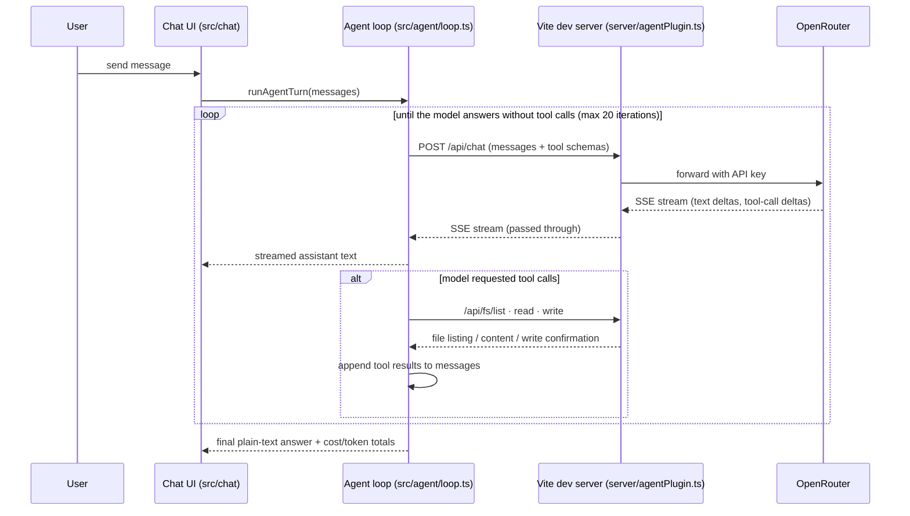
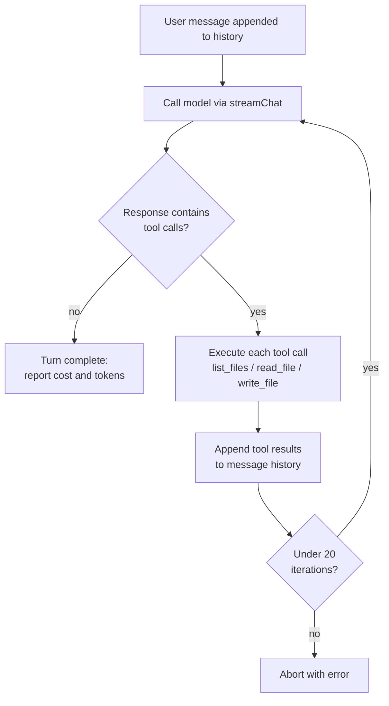

# ai-react — self-modifying coding-agent chat

A Vite + React + TypeScript app whose UI is a chat with an internal coding agent
(via [OpenRouter](https://openrouter.ai)). The agent can create and modify this
app's own source files; Vite HMR shows every change live in the browser.

## Setup

1. Copy `.env.example` to `.env` and set `OPENROUTER_API_KEY` (the key stays on
   the dev server — it is never sent to the browser).
2. `npm install`
3. `npm run dev` and open http://localhost:5173

Default model: `~anthropic/claude-haiku-latest` (OpenRouter routing alias);
change it in the model picker in the header — any OpenRouter model id works.

## How it works

- `server/agentPlugin.ts` — Vite dev-server middleware: proxies chat requests
  to OpenRouter (streaming SSE) and exposes sandboxed filesystem endpoints
  (`/api/fs/list|read|write`) restricted to the project root.
- `src/agent/` — the agent loop in the browser: model requests tool calls
  (`list_files`, `read_file`, `write_file`), the loop executes them against the
  dev server and feeds results back until the model answers in plain text.
- `src/chat/` — the chat UI (streaming messages, collapsible tool-call cards).
- `server/services/` — the service supervisor: manifests, port allocation,
  process lifecycle and the `/svc/<name>` proxy (see Services below).

The agent is dev-mode only; a production build contains no agent backend.

## The agent loop

The heart of the app is `runAgentTurn` in `src/agent/loop.ts`. One *turn* starts
when the user sends a message and ends when the model replies with plain text
instead of tool calls. In between, the loop may call the model several times
(up to 20 iterations), executing the requested tools after each call and
appending the results to the conversation before asking the model again.

All of this runs in the browser. The Vite dev server is only involved as a
proxy (so the OpenRouter API key never reaches the browser) and as the
sandboxed filesystem backend:



Control flow inside the loop itself:



Key details:

- **Streaming:** `src/agent/openrouter.ts` parses the SSE stream chunk by
  chunk — text deltas update the UI live, while tool-call fragments (name and
  arguments arrive in pieces) are accumulated until the stream ends.
- **History is the state:** the loop mutates the `messages` array in place.
  Each iteration appends the assistant message (with its `tool_calls`) and one
  `tool` message per result, so the model always sees what its tools returned.
- **Errors are fed back, not thrown:** a failed tool call (invalid path,
  protected file, bad JSON arguments) becomes an `ERROR: …` tool result, giving
  the model a chance to correct itself in the next iteration.
- **Snapshots:** the first `write_file` of a turn carries the `turnId`, which
  triggers the pre-modification git snapshot on the server (see Safety below).
- **Accounting:** OpenRouter reports token and cost usage in the final SSE
  chunk of each model call; the loop sums these across iterations and reports
  the total for the turn.

## Services

The agent can build backends, not just pages. Each service lives in
`services/<name>/` and runs as its own Node process next to the dev server:

```
create_service  →  write_file services/notes-api/index.ts  →  control_service start
```

- **The manifest is server-owned.** `services/<name>/service.json` is written
  only by `/api/services/create`, which validates the name, allocates the port
  and rejects reserved env keys. `write_file` refuses that path, so the agent
  can never grant itself a port or widen its own sandbox. Service *source* files
  in the same directory stay writable.
- **Declared state, reconciled.** The manifests are the desired state. The
  supervisor reconciles on dev-server boot, after every turn and after a
  rollback — which is what makes a failed turn's service stop when its manifest
  disappears. `enabled: false` (what the panel's stop button sets) means "the
  user stopped this by hand": reconciliation and the health gate leave it alone.
- **Reached through a proxy.** Components call `fetch('/svc/notes-api/items')`,
  never `http://localhost:4001`. Same origin, no CORS, and no port number
  anywhere in component code.
- **Sandboxed.** Services run under Node's permission model
  (`--permission --allow-fs-read/write=<service dir>`). A service may use the
  network and import installed packages, but reading `.env`, writing outside its
  own directory and spawning processes all fail with `ERR_ACCESS_DENIED`.
- **Visible.** The Services panel in the chat shows state, port and uptime, with
  start/stop/restart buttons and a log tail.

Processes die with the dev server and are restarted from their manifests on the
next boot. Docker containers (Postgres, Elasticsearch) are M2 — see
`docs/superpowers/specs/2026-09-16-agent-services-docker-design.md`.

## Safety

- **Protected runtime:** the agent can read but never write its own runtime —
  `server/`, `src/agent/`, `src/chat/`, `vite.config.ts`, `src/main.tsx`,
  `index.html`, `package.json`, `tsconfig*.json`. `.env*`, `package-lock.json`,
  `node_modules/`, and `.git/` are fully invisible to it.
- **Git snapshots:** before the agent's first file write in each chat turn, the
  server commits a snapshot (`agent snapshot (pre-modification)`).
- **Self-healing:** `write_file` rejects code that does not parse. After the
  agent's final answer the dev server probes every changed module
  (`/api/health/probe`), collects browser runtime errors and runs `tsc --noEmit`
  (`/api/health/typecheck`). A service that will not start, or that dies during
  the turn, counts as broken too — its exit code and log tail are reported back.
  Problems are fed back into the same turn — three repair attempts, then an
  automatic rollback to the turn's snapshot (`/api/git/rollback`), which also
  reconciles services so the failed turn's processes are stopped. A crash within 30 s after a turn is repaired
  automatically; later ones offer a "Repair" button in the chat.
- **The chat survives a crash:** `AppErrorBoundary` mounts the chat next to the
  error, so the agent stays reachable even when `App.tsx` crashes while
  rendering.

### Rolling back agent changes

```sh
git log --oneline          # find the snapshot (or any) commit
git reset --hard <hash>    # restore that state
```
